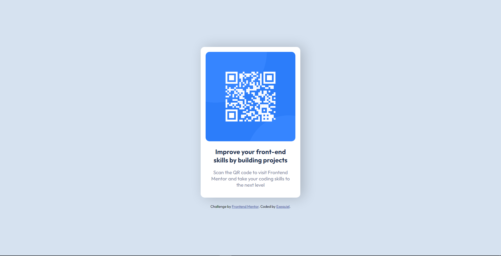

# Frontend Mentor - QR code component solution

This is a solution to the [QR code component challenge on Frontend Mentor](https://www.frontendmentor.io/challenges/qr-code-component-iux_sIO_H). Frontend Mentor challenges help you improve your coding skills by building realistic projects.

## Table of contents

- [Overview](#overview)
  - [Screenshot](#screenshot)
  - [Links](#links)
- [My process](#my-process)
  - [Built with](#built-with)
- [Author](#author)
- [Acknowledgments](#acknowledgments)

## Overview

### Screenshot

### Links

- Solution URL: [https://github.com/quielLovesLasagna/qr-code-component#links](https://github.com/quielLovesLasagna/qr-code-component#links)
- Live Site URL: [https://quiel-qr-code-component.netlify.app/](https://quiel-qr-code-component.netlify.app/)

## My process

### Built with

- Semantic HTML5 markup
- CSS3

## Author

- GitHub - [quielLovesLasagna](https://github.com/quielLovesLasagna)
- Frontend Mentor - [@@quielLovesLasagna](https://www.frontendmentor.io/profile/quielLovesLasagna)
